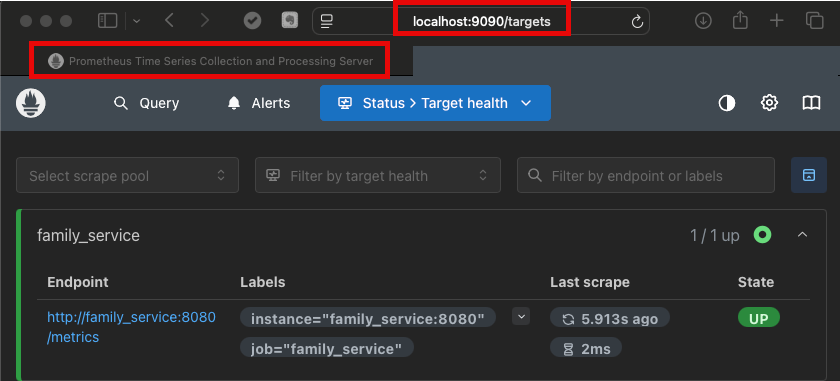
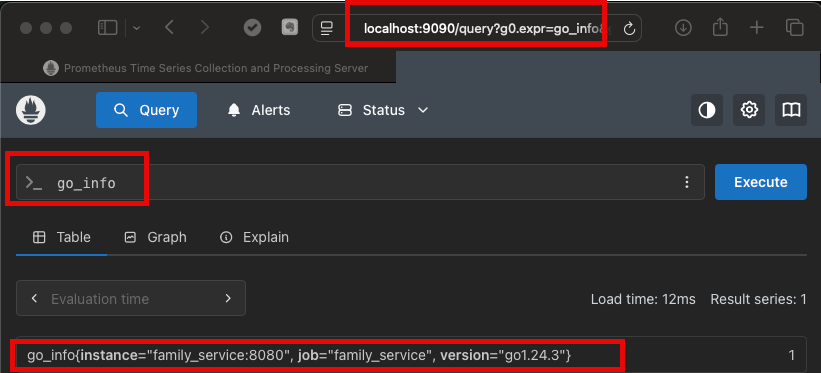
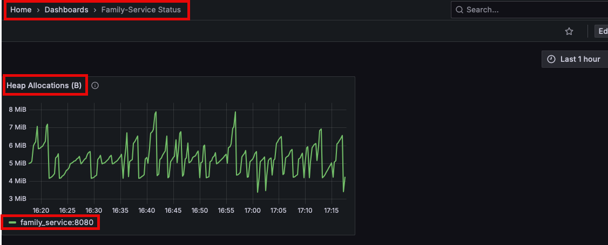
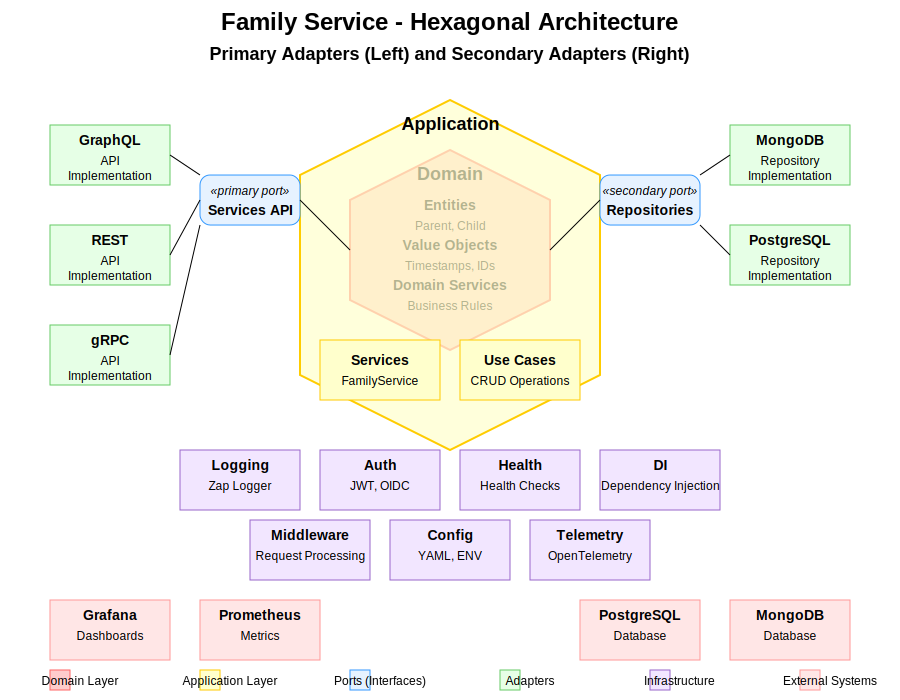

# Family Service

A comprehensive service for managing family data using GraphQL in a hexagonal architecture with support for both MongoDB and PostgreSQL databases.

## Overview

Family Service is a GraphQL API that provides endpoints for creating, reading, updating, and deleting family data. It supports:

- Parent management (create, read, update, delete)
- Child management (create, read, update, delete)
- Parent-child relationships
- Filtering, pagination, and sorting
- Multiple database backends (MongoDB and PostgreSQL)
- Observability through Prometheus and Grafana Dashboard
- Telemetry and logging

## API

The service exposes a GraphQL API with the following primary operations:

### Queries

- `parent(id: ID!)`: Get a parent by ID
- `parents(filter: ParentFilter, pagination: PaginationInput, sort: SortInput)`: List all parents with optional filtering, pagination, and sorting
- `child(id: ID!)`: Get a child by ID
- `children(filter: ChildFilter, pagination: PaginationInput, sort: SortInput)`: List all children with optional filtering, pagination, and sorting
- `childrenByParent(parentId: ID!, filter: ChildFilter, pagination: PaginationInput, sort: SortInput)`: List children for a specific parent

### Mutations

- `createParent(input: CreateParentInput!)`: Create a new parent
- `updateParent(id: ID!, input: UpdateParentInput!)`: Update an existing parent
- `deleteParent(id: ID!)`: Delete a parent
- `createChild(input: CreateChildInput!)`: Create a new child
- `updateChild(id: ID!, input: UpdateChildInput!)`: Update an existing child
- `deleteChild(id: ID!)`: Delete a child
- `addChildToParent(parentId: ID!, childId: ID!)`: Add a child to a parent
- `removeChildFromParent(parentId: ID!, childId: ID!)`: Remove a child from a parent

For detailed schema information, see the [GraphQL schema](internal/adapters/graphql/schema.graphql).

## Installation

### Prerequisites

- Go 1.21 or higher
- MongoDB or PostgreSQL
- Make

> **Note:** It is recommended to add an entry to "/etc/hosts" for "family_service" pointing to 127.0.0.1. This permits using the hostname in scripts and code for both Docker and CLI.

### Steps

1. Clone the repository:
   ```bash
   git clone https://github.com/abitofhelp/family-service2.git
   cd family-service2
   ```

2. Initialize the development environment:
   ```bash
   make init
   ```

3. Build the application:
   ```bash
   make build
   ```

## Configuration

The application utilizes a configuration file (config.yaml) and environment variables for configuration purposes. Default configuration values are set in the `initConfig` function in `cmd/server/main.go`.

Key configuration options:

- `server.port`: The port the server listens on (default: 8080)
- `log.level`: Logging level (default: info)
- `log.development`: Whether to use development mode for logging (default: false)
- `database.type`: Database type to use (mongodb or postgres, default: mongodb)
- `database.postgres.dsn`: PostgreSQL connection string
- `database.mongodb.uri`: MongoDB connection URI (including database name)
- `features.use_generics`: Whether to use generic repositories (default: true)

## Usage

### Running the Application

To run the application:

```bash
make run
```

For development with hot reloading:

```bash
make dev
```

### API Examples

#### List All Parents and Children

To list all parents and their children using curl:

```bash
curl -X POST \
  -H "Content-Type: application/json" \
  -d '{
    "query": "query { 
      parents(pagination: {pageSize: 10}) { 
        edges { 
          node { 
            id 
            firstName 
            lastName 
            email 
            birthDate 
            children { 
              id 
              firstName 
              lastName 
              birthDate 
            } 
          } 
        } 
        totalCount 
      } 
    }"
  }' \
  http://localhost:8080/graphql
```

This query retrieves the first 10 parents along with their children, including basic information for each.

#### Health Status

To check the health status of the server:

```bash
curl -X GET http://localhost:8080/health
```

This will return a JSON response with the current health status of the server and its dependencies:

```json
{
  "status": "healthy",
  "timestamp": "2023-06-15T10:30:45Z",
  "version": "1.0.0",
  "services": {
    "database": "up"
  }
}
```

The status will be either "healthy" or "degraded" depending on the state of the services. The HTTP status code will be 200 OK for healthy and 503 Service Unavailable for degraded.

#### Metrics

The application exports metrics using the OpenTelemetry Protocol (OTLP) to an external collector. To access these metrics, you need to query the collector's API. Assuming you're using a standard OpenTelemetry collector with Prometheus endpoint enabled:

```bash
curl -X GET http://localhost:9090/api/v1/query?query=http_requests_total
```

This will return metrics for the total number of HTTP requests processed by the service. You can query other metrics by changing the query parameter:

```bash
# Query database operation metrics
curl -X GET http://localhost:9090/api/v1/query?query=db_operations_total

# Query application error metrics
curl -X GET http://localhost:9090/api/v1/query?query=app_errors_total

# Query HTTP request duration (as a histogram)
curl -X GET http://localhost:9090/api/v1/query?query=http_request_duration_bucket
```

The metrics endpoint port and path may vary depending on your OpenTelemetry collector configuration. The examples above assume a standard Prometheus endpoint on port 9090.

## Prometheus Validation

The following queries can be used to verify that Prometheus is successfully scraping the family_service:

### Target Status

The following query shows that Prometheus is successfully scraping the family_service target:



### Go Information

The following query shows Go runtime information being successfully collected from the family_service:



## Grafana Monitoring

The following dashboard presents heap allocation information scraped by Prometheus from the family_service:



The custom dashboard JSON can be found in `docs/assets/grafana_dashboard_for_family_service.json`.

### Database Migrations

To run database migrations:

```bash
# For MongoDB
make migrate-mongo

# For PostgreSQL
make migrate-postgres

# For both
make migrate
```

### Testing

To run all tests:

```bash
make test
```

For more testing options, see the Makefile commands below.

## Authentication

The Family Service API supports both JWT and OpenID Connect (OIDC) authentication methods. Authentication is required for write operations (mutations), while read operations (queries) can be performed without authentication.

### Authentication Methods

#### JWT Authentication

JWT (JSON Web Token) authentication is the default authentication method. To authenticate:

1. Obtain a JWT token by calling the authentication endpoint:

```bash
curl -X POST \
  -H "Content-Type: application/json" \
  -d '{
    "username": "your_username",
    "password": "your_password"
  }' \
  http://localhost:8080/auth/login
```

2. Include the token in the Authorization header for subsequent requests:

```bash
curl -X POST \
  -H "Content-Type: application/json" \
  -H "Authorization: Bearer YOUR_JWT_TOKEN" \
  -d '{
    "query": "mutation { createParent(input: { firstName: \"John\", lastName: \"Doe\", email: \"john@example.com\", birthDate: \"1980-01-01\" }) { id } }"
  }' \
  http://localhost:8080/graphql
```

#### OIDC Authentication

For OpenID Connect authentication:

1. Configure your OIDC provider in the application configuration:

```yaml
auth:
  oidc:
    issuer_url: "https://your-identity-provider.com"
    client_id: "your-client-id"
    client_secret: "your-client-secret"
    redirect_url: "http://localhost:8080/auth/callback"
    admin_role_name: "admin"
```

2. Obtain a token from your OIDC provider using their authentication flow.

3. Include the token in the Authorization header for API requests:

```bash
curl -X POST \
  -H "Content-Type: application/json" \
  -H "Authorization: Bearer YOUR_OIDC_TOKEN" \
  -d '{
    "query": "mutation { createParent(input: { firstName: \"John\", lastName: \"Doe\", email: \"john@example.com\", birthDate: \"1980-01-01\" }) { id } }"
  }' \
  http://localhost:8080/graphql
```

### Authorization

The service uses role-based authorization:

- **Admin users** (with the "admin" role) have full access to all operations.
- **Regular users** can only perform read operations (queries) but not write operations (mutations).
- **Unauthenticated users** can only perform read operations.

### Token Format

JWT tokens contain the following claims:

```json
{
  "sub": "user-id",
  "roles": ["user", "admin"],
  "exp": 1672531200,
  "iat": 1672527600,
  "nbf": 1672527600,
  "iss": "family-service"
}
```

- `sub`: The user ID
- `roles`: Array of user roles
- `exp`: Expiration time
- `iat`: Issued at time
- `nbf`: Not valid before time
- `iss`: Issuer

## Makefile Commands

The project includes a comprehensive Makefile with the following commands:

```
make init              - Initialize development environment
make generate          - Generate GraphQL code
make build             - Build the application
make test              - Run all tests
make test-all          - Run all tests with coverage and generate a combined report
make test-unit         - Run unit tests only
make test-integration  - Run integration tests only
make test-race         - Run tests with race detection
make test-timeout      - Run tests with timeout
make test-package      - Run tests for a specific package (PKG=./path/to/package)
make test-package-coverage - Run tests with coverage for a specific package (PKG=./path/to/package)
make test-run          - Run tests matching a specific pattern (PATTERN=TestName)
make test-run-coverage - Run tests with coverage matching a specific pattern (PATTERN=TestName)
make test-bench        - Run benchmarks
make test-coverage     - Generate test coverage report
make test-coverage-view - View test coverage in browser
make test-coverage-summary - Show test coverage summary
make test-coverage-func - Show test coverage by function
make test-coverage-func-sorted - Show test coverage by function, sorted
make clean             - Remove build artifacts
make run               - Run the application locally
make dev               - Run the application with hot reloading
make lint              - Run linters
make vuln-check        - Check for vulnerabilities in dependencies
make deploy            - Deploy the application
make migrate-mongo     - Run MongoDB migrations
make migrate-postgres  - Run PostgreSQL migrations
make migrate           - Run all migrations
make airconfig         - Create a basic .air.toml configuration file
make dockerfile        - Create a basic Dockerfile
make docker            - Build Docker image
make docker-run        - Run Docker container
make tidy              - Tidy and verify Go modules
make help              - Show this help message
```

## Architecture

Family Service follows the hexagonal architecture pattern (also known as ports and adapters), which separates the application into layers with well-defined responsibilities and dependencies. The key principle is that dependencies point inward, with the domain at the center.

### Hexagonal Architecture Diagram



### Key Benefits of Hexagonal Architecture

1. **Separation of Concerns**: Each layer has a specific responsibility
2. **Testability**: Business logic can be tested independently of external systems
3. **Flexibility**: External components can be replaced without affecting the core business logic
4. **Maintainability**: Clear boundaries make the codebase easier to understand and maintain

### Architectural Layers

#### 1. Domain Layer

The domain layer is at the core of the application and contains the business entities and business rules.

**Key Components:**
- **Entities**: `Parent` and `Child` models that represent the core business concepts
- **Entity Interface**: Common behavior for all domain entities

**Example Files:**
- `internal/domain/parent.go`
- `internal/domain/child.go`
- `internal/domain/entity.go`

#### 2. Ports Layer

The ports layer defines interfaces that the application uses to interact with external systems. These interfaces are implemented by adapters in the infrastructure layer.

**Key Components:**
- **Repository Interfaces**: Define data access operations
- **Service Interfaces**: Define business operations
- **Transaction Manager**: Manages database transactions
- **Generic Repository Interface**: Provides a type-safe generic interface for CRUD operations

**Example Files:**
- `internal/ports/repositories.go`
- `internal/ports/services.go`
- `internal/ports/generic_repository.go`

#### 3. Application Layer

The application layer implements business logic by coordinating between domain models and ports. It contains the use cases of the application.

**Key Components:**
- **FamilyService**: Implements business operations for managing families

**Example Files:**
- `internal/application/family_service.go`

#### 4. Adapters Layer

The adapters layer contains concrete implementations of the interfaces defined in the ports layer. These adapters connect the application to external systems like databases and APIs.

**Key Components:**
- **GraphQL API**: Exposes the application's functionality via GraphQL
- **MongoDB Repositories**: Implement repository interfaces for MongoDB
- **PostgreSQL Repositories**: Implement repository interfaces for PostgreSQL

**Example Files:**
- `internal/adapters/graphql/schema.resolvers.go`
- `internal/adapters/mongodb/parent_repository.go`
- `internal/adapters/postgres/parent_repository.go`

#### 5. Infrastructure Layer

The infrastructure layer contains cross-cutting concerns and utilities used across the application.

**Key Components:**
- **Logging**: Centralized logging using Zap
- **Telemetry**: Distributed tracing and metrics using OpenTelemetry
- **Authentication**: JWT and OIDC authentication
- **Dependency Injection**: Container for managing dependencies

**Example Files:**
- `internal/infrastructure/logging/logger.go`
- `internal/infrastructure/telemetry/tracer.go`
- `internal/infrastructure/auth/jwt.go`
- `internal/infrastructure/di/container.go`

### Application Entry Point

The application's entry point is in the `cmd/server/main.go` file. This file initializes the application, sets up the HTTP server, and handles graceful shutdown.

#### Initialization Process

1. **Create Root Context**: A root context with cancellation is created to manage the application lifecycle
2. **Initialize Configuration**: The `initConfig` function sets up configuration using Viper, which reads from a config file and environment variables
3. **Initialize Logger**: A Zap logger is created for structured logging
4. **Initialize Dependency Injection Container**: The DI container initializes all application components
5. **Set Up HTTP Server**: An HTTP server is created with health check endpoints
6. **Start Server**: The server is started in a goroutine
7. **Wait for Shutdown Signal**: The application waits for an interrupt signal or context cancellation
8. **Graceful Shutdown**: When a shutdown signal is received, the server is shut down gracefully

```
func main() {
    // Create a root context with cancellation
    rootCtx, rootCancel := context.WithCancel(context.Background())
    defer rootCancel()

    // Initialize configuration
    initConfig()

    // Initialize logger
    logger, err := logging.NewLogger(viper.GetString("log.level"), viper.GetBool("log.development"))
    if err != nil {
        log.Fatalf("Failed to initialize logger: %v", err)
    }
    defer logger.Sync()

    // Initialize dependency injection container
    container, err := di.NewContainer(rootCtx, logger)
    if err != nil {
        logger.Fatal("Failed to initialize dependency injection container", zap.Error(err))
    }
    defer container.Close()

    // Set up HTTP server and start it
    // ...

    // Wait for interrupt signal to gracefully shut down the server
    // ...
}
```

### Dependency Injection

The application uses a custom dependency injection container to manage component lifecycles and dependencies. The container is defined in `internal/infrastructure/di/container.go`.

#### Key Components Managed by the Container

1. **Logger**: Zap logger for structured logging
2. **Validator**: Validator for input validation
3. **Repository Factory**: Factory for creating repositories based on the configured database type
4. **Family Service**: Service for managing families
5. **Authorization Service**: Service for authentication and authorization
6. **Telemetry**: Components for distributed tracing and metrics

```
func NewContainer(ctx context.Context, logger *zap.Logger) (*Container, error) {
    container := &Container{
        ctx:    ctx,
        logger: logger,
    }

    // Initialize validator
    container.validator = validator.New()


    // Initialize repository factory based on database type
    // ...

    // Initialize authorization service
    // ...

    // Initialize family service
    container.familyService = application.NewFamilyService(
        container.repositoryFactory,
        container.validator,
        container.logger,
    )

    return container, nil
}
```

### Database Support

The application supports both MongoDB and PostgreSQL databases through the repository factory pattern. The factory creates the appropriate repositories based on the configured database type.

#### MongoDB Support

MongoDB repositories are implemented in the `internal/adapters/mongodb` package. They use the official MongoDB Go driver to interact with the database.

#### PostgreSQL Support

PostgreSQL repositories are implemented in the `internal/adapters/postgres` package. They use the `database/sql` package with the `lib/pq` driver to interact with the database.

The application also supports generic repositories for PostgreSQL, which use Go's generics feature to reduce code duplication. These generic repositories implement the `Repository[T]` interface defined in the ports layer, providing type-safe CRUD operations for different entity types. This approach significantly reduces boilerplate code while maintaining type safety.

**Example Files:**
- `internal/adapters/postgres/generic_repository_factory.go`
- `internal/adapters/postgres/generic_parent_repository.go`
- `internal/adapters/postgres/generic_child_repository.go`

#### Database Transactions

The application supports database transactions for both MongoDB and PostgreSQL through the `TransactionManager` interface defined in the ports layer. This interface provides methods for beginning, committing, and rolling back transactions, as well as a helper method for executing a function within a transaction.

**Transaction Manager Interface:**
```
// TransactionManager defines the interface for managing database transactions
type TransactionManager interface {
    // BeginTx begins a new transaction
    BeginTx(ctx context.Context) (context.Context, error)

    // CommitTx commits the current transaction
    CommitTx(ctx context.Context) error

    // RollbackTx rolls back the current transaction
    RollbackTx(ctx context.Context) error
}
```

**MongoDB Transactions:**
- MongoDB transactions are implemented using the MongoDB Go driver's session API
- Transactions are stored in the context using a context key
- The implementation handles context cancellation gracefully
- A helper method `WithTx` is provided for executing a function within a transaction

**PostgreSQL Transactions:**
- PostgreSQL transactions are implemented using the pgx driver's transaction API
- Transactions are stored in the context using a context key
- The implementation handles panics by rolling back the transaction
- A helper method `WithTx` is provided for executing a function within a transaction

**Example Usage:**
```
// Using the transaction manager directly
ctx, err := txManager.BeginTx(ctx)
if err != nil {
    return err
}

// Execute operations within the transaction
err = repository.Create(ctx, entity)
if err != nil {
    txManager.RollbackTx(ctx)
    return err
}

// Commit the transaction
err = txManager.CommitTx(ctx)
if err != nil {
    return err
}

// Using the WithTx helper method
err = txManager.WithTx(ctx, func(ctx context.Context) error {
    // Execute operations within the transaction
    return repository.Create(ctx, entity)
})
```

### API Layer

The application exposes a GraphQL API for client interaction. The API is implemented using the `github.com/99designs/gqlgen` library.

#### Key Components

1. **Schema**: Defines the GraphQL schema in `internal/adapters/graphql/schema.graphql`
2. **Resolvers**: Implement the GraphQL resolvers in `internal/adapters/graphql/schema.resolvers.go`
3. **Models**: Generated GraphQL models in `internal/adapters/graphql/models_gen.go`

### Cross-Cutting Concerns

#### Logging

The application uses Zap for structured logging. The logger is initialized in `internal/infrastructure/logging/logger.go`.

#### Telemetry

The application uses OpenTelemetry for distributed tracing and metrics. Telemetry components are defined in the `internal/infrastructure/telemetry` package.


#### Authentication and Authorization

The application supports JWT and OIDC authentication through the components in the `internal/infrastructure/auth` package.

## Project Structure

```
.
├── cmd/                  # Application entry points
│   └── server/           # Server application
├── docs/                 # Documentation
│   └── assets/              # Documentation assets
│       └── hex_architecture_diagram.svg  # Hexagonal architecture diagram
├── internal/             # Internal packages
│   ├── adapters/         # Adapters for external systems
│   │   ├── graphql/      # GraphQL API
│   │   ├── mongodb/      # MongoDB adapter
│   │   └── postgres/     # PostgreSQL adapter
│   ├── application/      # Application services
│   ├── domain/           # Domain models and business logic
│   ├── infrastructure/   # Infrastructure components
│   │   ├── auth/         # Authentication and authorization
│   │   ├── di/           # Dependency injection
│   │   ├── logging/      # Logging
│   │   └── telemetry/    # Telemetry and monitoring
│   ├── mocks/            # Mock implementations for testing
│   └── ports/            # Interface definitions
└── pkg/                  # Public packages
    └── stringutil/       # String utility functions
```

## Utility Packages

### String Utilities

The project includes a custom string utilities package with additional string manipulation functions beyond what's available in the standard library.

For details, see the [stringutil README](pkg/stringutil/README.md).

## Contributing

1. Fork the repository
2. Create a feature branch (`git checkout -b feature/my-feature`)
3. Commit your changes (`git commit -am 'Add my feature'`)
4. Push to the branch (`git push origin feature/my-feature`)
5. Create a new Pull Request

## License

This project is licensed under the MIT License - see the LICENSE file for details.
