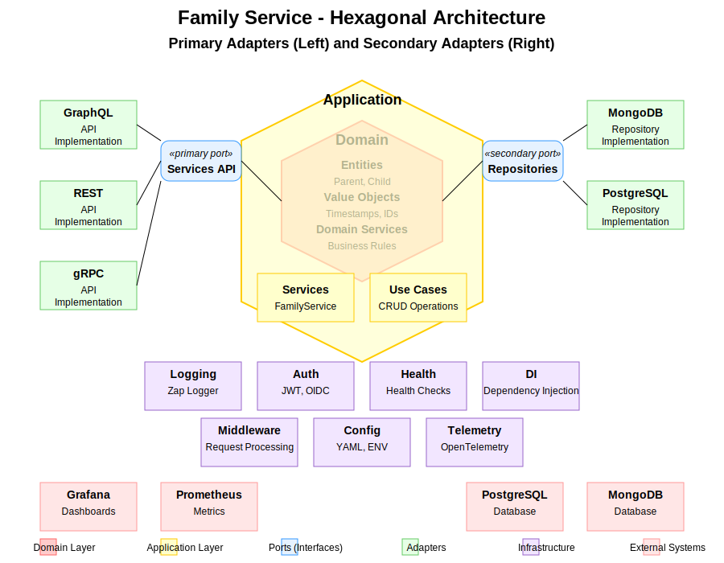
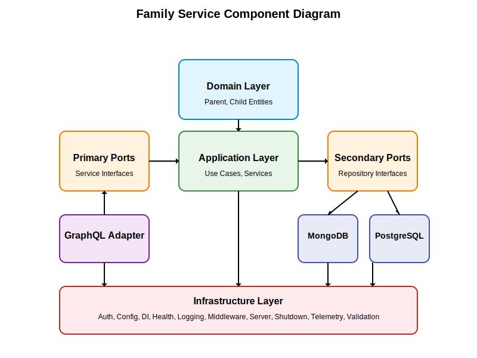
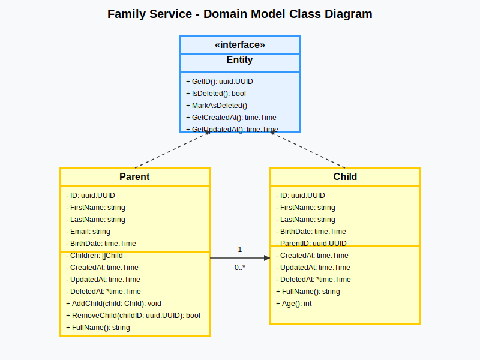
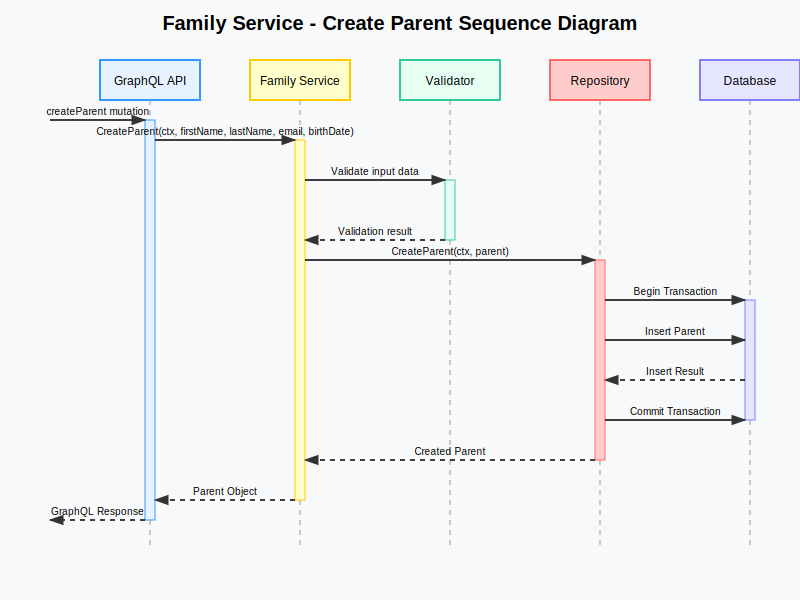

# Software Design Specification

## Family Service

**Version 1.0.0**

---

## Copyright and License

MIT License

Copyright (c) 2025 A Bit of Help, Inc.

Permission is hereby granted, free of charge, to any person obtaining a copy
of this software and associated documentation files (the "Software"), to deal
in the Software without restriction, including without limitation the rights
to use, copy, modify, merge, publish, distribute, sublicense, and/or sell
copies of the Software, and to permit persons to whom the Software is
furnished to do so, subject to the following conditions:

The above copyright notice and this permission notice shall be included in all
copies or substantial portions of the Software.

THE SOFTWARE IS PROVIDED "AS IS", WITHOUT WARRANTY OF ANY KIND, EXPRESS OR
IMPLIED, INCLUDING BUT NOT LIMITED TO THE WARRANTIES OF MERCHANTABILITY,
FITNESS FOR A PARTICULAR PURPOSE AND NONINFRINGEMENT. IN NO EVENT SHALL THE
AUTHORS OR COPYRIGHT HOLDERS BE LIABLE FOR ANY CLAIM, DAMAGES OR OTHER
LIABILITY, WHETHER IN AN ACTION OF CONTRACT, TORT OR OTHERWISE, ARISING FROM,
OUT OF OR IN CONNECTION WITH THE SOFTWARE OR THE USE OR OTHER DEALINGS IN THE
SOFTWARE.

---

## Table of Contents

1. [Introduction](#1-introduction)
   1. [Purpose](#11-purpose)
   2. [Scope](#12-scope)
   3. [Definitions, Acronyms, and Abbreviations](#13-definitions-acronyms-and-abbreviations)
   4. [References](#14-references)
   5. [Overview](#15-overview)
2. [System Overview](#2-system-overview)
   1. [System Context](#21-system-context)
   2. [System Functions](#22-system-functions)
   3. [User Characteristics](#23-user-characteristics)
   4. [Constraints](#24-constraints)
   5. [Assumptions and Dependencies](#25-assumptions-and-dependencies)
3. [Architecture](#3-architecture)
   1. [Architectural Approach](#31-architectural-approach)
   2. [Hexagonal Architecture](#32-hexagonal-architecture)
   3. [Component Diagram](#33-component-diagram)
   4. [Deployment Diagram](#34-deployment-diagram)
4. [Component Design](#4-component-design)
   1. [Domain Layer](#41-domain-layer)
   2. [Application Layer](#42-application-layer)
   3. [Ports Layer](#43-ports-layer)
   4. [Adapters Layer](#44-adapters-layer)
   5. [Infrastructure Layer](#45-infrastructure-layer)
5. [Data Design](#5-data-design)
   1. [Domain Model](#51-domain-model)
   2. [Data Storage](#52-data-storage)
   3. [Data Migration](#53-data-migration)
6. [Interface Design](#6-interface-design)
   1. [GraphQL API](#61-graphql-api)
   2. [Health API](#62-health-api)
   3. [Metrics API](#63-metrics-api)
7. [Operational Scenarios](#7-operational-scenarios)
   1. [Parent Management](#71-parent-management)
   2. [Child Management](#72-child-management)
   3. [Relationship Management](#73-relationship-management)
   4. [Health Monitoring](#74-health-monitoring)
8. [Requirements Matrix](#8-requirements-matrix)
9. [Appendices](#9-appendices)
   1. [Appendix A: Glossary](#appendix-a-glossary)
   2. [Appendix B: References](#appendix-b-references)

---

## 1. Introduction

### 1.1 Purpose

This Software Design Specification (SDS) describes the architectural and detailed design for the Family Service application. It is intended to be used by the development team to implement the system according to the specified design.

### 1.2 Scope

The Family Service is a backend application that provides APIs for managing family relationships, specifically parents and their children. The system allows creating, reading, updating, and deleting parent and child records, as well as managing the relationships between them.

The system exposes a GraphQL API for clients to interact with the service. It uses a hexagonal architecture pattern to separate the core business logic from external concerns such as databases and API protocols.

### 1.3 Definitions, Acronyms, and Abbreviations

- **API**: Application Programming Interface
- **CRUD**: Create, Read, Update, Delete
- **DI**: Dependency Injection
- **GraphQL**: A query language for APIs and a runtime for executing those queries
- **Hexagonal Architecture**: An architectural pattern that isolates the core business logic from external concerns
- **JWT**: JSON Web Token
- **OIDC**: OpenID Connect
- **REST**: Representational State Transfer
- **UUID**: Universally Unique Identifier

### 1.4 References

- Hexagonal Architecture (Ports and Adapters) pattern
- GraphQL Specification
- OpenTelemetry Specification
- MongoDB Documentation
- PostgreSQL Documentation

### 1.5 Overview

The remainder of this document is organized as follows:

- Section 2 provides an overall description of the system, including system context, functions, user characteristics, constraints, and assumptions.
- Section 3 describes the architecture of the system, including the hexagonal architecture pattern and component diagrams.
- Section 4 details the design of each component in the system.
- Section 5 describes the data design, including the domain model and data storage.
- Section 6 details the interface design, including the GraphQL API, health API, and metrics API.
- Section 7 describes the operational scenarios for the system.
- Section 8 provides a requirements matrix that maps requirements to design elements.
- Section 9 contains appendices with additional information.

---

## 2. System Overview

### 2.1 System Context

The Family Service is a standalone backend service that provides APIs for managing family relationships. It is designed to be used by various client applications, such as web applications, mobile applications, or other services.

The service interacts with the following external systems:

1. **Client Applications**: Web applications, mobile applications, or other services that use the GraphQL API to manage family relationships.
2. **Database**: MongoDB or PostgreSQL for storing family data.
3. **Authentication Provider**: An OIDC provider for authenticating API requests.
4. **Monitoring Systems**: Prometheus for collecting metrics and monitoring the service's health.

### 2.2 System Functions

The Family Service provides the following main functions:

1. **Parent Management**: Create, read, update, and delete parent records.
2. **Child Management**: Create, read, update, and delete child records.
3. **Relationship Management**: Associate children with parents and manage these relationships.
4. **Health Monitoring**: Provide health check endpoints for monitoring the service's health.

### 2.3 User Characteristics

The primary users of the Family Service are:

1. **Client Applications**: Web applications, mobile applications, or other services that need to manage family relationships.
2. **System Administrators**: Responsible for deploying, configuring, and monitoring the service.

### 2.4 Constraints

The Family Service has the following constraints:

1. **Technology Stack**: The service is implemented in Go and uses GraphQL for API communication.
2. **Database Support**: The service supports MongoDB and PostgreSQL as database backends.
3. **Authentication**: The service requires OIDC authentication for API access.
4. **Deployment**: The service is designed to be deployed in a Docker container.

### 2.5 Assumptions and Dependencies

The Family Service assumes the following:

1. **Database Availability**: MongoDB or PostgreSQL is available and accessible.
2. **Authentication Provider**: An OIDC provider is available for authentication.
3. **Monitoring Infrastructure**: Prometheus is available for metrics collection.

---

## 3. Architecture

### 3.1 Architectural Approach

The Family Service follows a hexagonal architecture pattern, also known as the ports and adapters pattern. This architectural style isolates the core business logic from external concerns such as databases and API protocols.

The key benefits of this approach include:

1. **Separation of Concerns**: The core business logic is separated from external concerns, making it easier to understand and maintain.
2. **Testability**: The core business logic can be tested independently of external systems.
3. **Flexibility**: The system can easily adapt to changes in external systems or technologies.
4. **Maintainability**: The system is easier to maintain because changes to one part of the system have minimal impact on other parts.

### 3.2 Hexagonal Architecture

The hexagonal architecture consists of the following layers:

1. **Domain Layer**: Contains the core business entities and business rules.
2. **Application Layer**: Contains the use cases and application services.
3. **Ports Layer**: Defines the interfaces for interacting with the application.
4. **Adapters Layer**: Implements the interfaces defined in the ports layer.
5. **Infrastructure Layer**: Provides technical capabilities to the system.



#### 3.2.1 Domain Layer

The domain layer contains the core business entities and business rules. It is independent of any external concerns and defines the domain model for the system.

#### 3.2.2 Application Layer

The application layer contains the use cases and application services. It orchestrates the flow of data to and from the domain entities and applies domain rules to achieve the goals of a use case.

#### 3.2.3 Ports Layer

The ports layer defines the interfaces for interacting with the application. It includes:

- **Primary Ports**: Interfaces that allow the application to be driven by external actors.
- **Secondary Ports**: Interfaces that allow the application to drive external systems.

#### 3.2.4 Adapters Layer

The adapters layer implements the interfaces defined in the ports layer. It includes:

- **Primary Adapters**: Implement the primary ports and are driven by external actors (e.g., GraphQL, REST).
- **Secondary Adapters**: Implement the secondary ports and are driven by the application (e.g., repositories).

#### 3.2.5 Infrastructure Layer

The infrastructure layer provides technical capabilities to the system, such as:

- **Logging**: For recording events and errors.
- **Authentication**: For verifying user identity.
- **Configuration**: For managing application settings.
- **Dependency Injection**: For managing object creation and dependencies.
- **Health Monitoring**: For checking the health of the system.
- **Telemetry**: For collecting metrics and traces.

### 3.3 Component Diagram

The following component diagram illustrates the high-level components of the Family Service and their relationships:



The diagram shows the following components:

1. **Domain Layer**: Contains the Parent and Child entities.
2. **Application Layer**: Contains the use cases and services.
3. **Ports Layer**: Contains the primary ports (service interfaces) and secondary ports (repository interfaces).
4. **Adapters Layer**: Contains the GraphQL adapter (primary adapter) and the MongoDB and PostgreSQL adapters (secondary adapters).
5. **Infrastructure Layer**: Contains the infrastructure components such as auth, config, DI, health, logging, middleware, server, shutdown, telemetry, and validation.

### 3.4 Deployment Diagram

The Family Service is designed to be deployed in a Docker container. The following deployment diagram illustrates the deployment architecture:

```
+------------------+     +------------------+     +------------------+
|                  |     |                  |     |                  |
|  Client          |     |  Family Service  |     |  Database        |
|  Applications    |<--->|  Container       |<--->|  (MongoDB or     |
|                  |     |                  |     |   PostgreSQL)    |
|                  |     |                  |     |                  |
+------------------+     +------------------+     +------------------+
                                 ^
                                 |
                                 v
                         +------------------+
                         |                  |
                         |  Monitoring      |
                         |  (Prometheus)    |
                         |                  |
                         |                  |
                         +------------------+
```

---

## 4. Component Design

### 4.1 Domain Layer

The domain layer contains the core business entities and business rules. It is independent of any external concerns and defines the domain model for the system.

#### 4.1.1 Entity Interface

The Entity interface defines the common behavior for all domain entities:

```
type Entity interface {
    GetID() string
    IsDeleted() bool
    MarkAsDeleted()
    GetCreatedAt() time.Time
    GetUpdatedAt() time.Time
    GetDeletedAt() *time.Time
}
```

#### 4.1.2 Parent Entity

The Parent entity represents a parent in the system:

```
type Parent struct {
    ID        string
    FirstName string
    LastName  string
    Email     string
    BirthDate time.Time
    Children  []Child
    CreatedAt time.Time
    UpdatedAt time.Time
    DeletedAt *time.Time
}
```

Methods:
- **AddChild()**: Adds a child to the parent's list of children.
- **RemoveChild()**: Removes a child from the parent's list of children.
- **FullName()**: Returns the parent's full name.

#### 4.1.3 Child Entity

The Child entity represents a child in the system:

```
type Child struct {
    ID        string
    FirstName string
    LastName  string
    BirthDate time.Time
    ParentID  string
    CreatedAt time.Time
    UpdatedAt time.Time
    DeletedAt *time.Time
}
```

Methods:
- **FullName()**: Returns the child's full name.
- **Age()**: Calculates the child's current age based on their birth date.

### 4.2 Application Layer

The application layer contains the use cases and application services. It orchestrates the flow of data to and from the domain entities and applies domain rules to achieve the goals of a use case.

#### 4.2.1 Parent Service

The Parent Service implements the use cases for managing parents:

```
type ParentService struct {
    parentRepository ParentRepository
    validator        Validator
}
```

Methods:
- **CreateParent()**: Creates a new parent.
- **GetParentByID()**: Retrieves a parent by ID.
- **UpdateParent()**: Updates a parent.
- **DeleteParent()**: Deletes a parent.
- **ListParents()**: Lists parents with pagination and filtering.
- **CountParents()**: Counts parents based on filter criteria.

#### 4.2.2 Child Service

The Child Service implements the use cases for managing children:

```
type ChildService struct {
    childRepository  ChildRepository
    parentRepository ParentRepository
    validator        Validator
}
```

Methods:
- **CreateChild()**: Creates a new child.
- **GetChildByID()**: Retrieves a child by ID.
- **UpdateChild()**: Updates a child.
- **DeleteChild()**: Deletes a child.
- **ListChildrenByParentID()**: Lists children for a specific parent.
- **ListChildren()**: Lists children with pagination and filtering.
- **CountChildren()**: Counts children based on filter criteria.

### 4.3 Ports Layer

The ports layer defines the interfaces for interacting with the application.

#### 4.3.1 Primary Ports

The primary ports define how external actors interact with the application:

```
type ParentService interface {
    CreateParent(ctx context.Context, input CreateParentInput) (*Parent, error)
    GetParentByID(ctx context.Context, id string) (*Parent, error)
    UpdateParent(ctx context.Context, id string, input UpdateParentInput) (*Parent, error)
    DeleteParent(ctx context.Context, id string) error
    ListParents(ctx context.Context, filter ParentFilter, pagination Pagination) ([]*Parent, error)
    CountParents(ctx context.Context, filter ParentFilter) (int64, error)
}

type ChildService interface {
    CreateChild(ctx context.Context, input CreateChildInput) (*Child, error)
    GetChildByID(ctx context.Context, id string) (*Child, error)
    UpdateChild(ctx context.Context, id string, input UpdateChildInput) (*Child, error)
    DeleteChild(ctx context.Context, id string) error
    ListChildrenByParentID(ctx context.Context, parentID string, pagination Pagination) ([]*Child, error)
    ListChildren(ctx context.Context, filter ChildFilter, pagination Pagination) ([]*Child, error)
    CountChildren(ctx context.Context, filter ChildFilter) (int64, error)
}
```

#### 4.3.2 Secondary Ports

The secondary ports define how the application interacts with external systems:

```
type ParentRepository interface {
    Create(ctx context.Context, parent *Parent) error
    GetByID(ctx context.Context, id string) (*Parent, error)
    Update(ctx context.Context, parent *Parent) error
    Delete(ctx context.Context, id string) error
    List(ctx context.Context, filter ParentFilter, pagination Pagination) ([]*Parent, error)
    Count(ctx context.Context, filter ParentFilter) (int64, error)
}

type ChildRepository interface {
    Create(ctx context.Context, child *Child) error
    GetByID(ctx context.Context, id string) (*Child, error)
    Update(ctx context.Context, child *Child) error
    Delete(ctx context.Context, id string) error
    ListByParentID(ctx context.Context, parentID string, pagination Pagination) ([]*Child, error)
    List(ctx context.Context, filter ChildFilter, pagination Pagination) ([]*Child, error)
    Count(ctx context.Context, filter ChildFilter) (int64, error)
}
```

### 4.4 Adapters Layer

The adapters layer implements the interfaces defined in the ports layer.

#### 4.4.1 Primary Adapters

The primary adapters implement the primary ports and are driven by external actors:

##### 4.4.1.1 GraphQL Adapter

The GraphQL adapter implements the primary ports and exposes them as GraphQL queries and mutations:

```
type GraphQLResolver struct {
    parentService ParentService
    childService  ChildService
}
```

Queries:
- **parent()**: Retrieves a parent by ID.
- **parents()**: Lists parents with pagination and filtering.
- **parentsCount()**: Counts parents based on filter criteria.
- **child()**: Retrieves a child by ID.
- **children()**: Lists children with pagination and filtering.
- **childrenCount()**: Counts children based on filter criteria.
- **childrenByParent()**: Lists children for a specific parent.

Mutations:
- **createParent()**: Creates a new parent.
- **updateParent()**: Updates a parent.
- **deleteParent()**: Deletes a parent.
- **createChild()**: Creates a new child.
- **updateChild()**: Updates a child.
- **deleteChild()**: Deletes a child.

#### 4.4.2 Secondary Adapters

The secondary adapters implement the secondary ports and are driven by the application:

##### 4.4.2.1 MongoDB Adapter

The MongoDB adapter implements the repository interfaces for MongoDB:

```
type MongoDBParentRepository struct {
    collection *mongo.Collection
}

type MongoDBChildRepository struct {
    collection *mongo.Collection
}
```

##### 4.4.2.2 PostgreSQL Adapter

The PostgreSQL adapter implements the repository interfaces for PostgreSQL:

```
type PostgreSQLParentRepository struct {
    db *sql.DB
}

type PostgreSQLChildRepository struct {
    db *sql.DB
}
```

### 4.5 Infrastructure Layer

The infrastructure layer provides technical capabilities to the system.

#### 4.5.1 Auth

The auth package provides authentication and authorization capabilities:

```
type OIDCAuthenticator struct {
    provider *oidc.Provider
    config   *oidc.Config
}
```

#### 4.5.2 Config

The config package provides configuration management:

```
type Config struct {
    App       AppConfig
    Database  DatabaseConfig
    Server    ServerConfig
    Telemetry TelemetryConfig
    Auth      AuthConfig
    Log       LogConfig
    Features  FeaturesConfig
}
```

#### 4.5.3 Dependency Injection

The di package provides dependency injection capabilities:

```
type Container struct {
    config          *Config
    logger          *zap.Logger
    authenticator   *OIDCAuthenticator
    parentService   ParentService
    childService    ChildService
    parentRepository ParentRepository
    childRepository  ChildRepository
}
```

#### 4.5.4 Health

The health package provides health monitoring capabilities:

```
type HealthChecker struct {
    checks []HealthCheck
}
```

#### 4.5.5 Logging

The logging package provides logging capabilities:

```
type Logger struct {
    logger *zap.Logger
}
```

#### 4.5.6 Middleware

The middleware package provides HTTP middleware:

```
type AuthMiddleware struct {
    authenticator *OIDCAuthenticator
}
```

#### 4.5.7 Server

The server package provides HTTP server capabilities:

```
type Server struct {
    config     *ServerConfig
    router     *chi.Mux
    httpServer *http.Server
}
```

#### 4.5.8 Shutdown

The shutdown package provides graceful shutdown capabilities:

```
type GracefulShutdown struct {
    timeout time.Duration
    logger  *zap.Logger
}
```

#### 4.5.9 Telemetry

The telemetry package provides metrics and tracing capabilities:

```
type Telemetry struct {
    config   *TelemetryConfig
    meter    *metric.Meter
    tracer   *trace.Tracer
    provider *sdktrace.TracerProvider
}
```

#### 4.5.10 Validation

The validation package provides input validation capabilities:

```
type Validator struct {
    validate *validator.Validate
}
```

---

## 5. Data Design

### 5.1 Domain Model

The domain model for the Family Service consists of the following entities:



#### 5.1.1 Entity Interface

The Entity interface defines the common behavior for all domain entities:

- **GetID()**: Returns the entity's unique identifier.
- **IsDeleted()**: Checks if the entity is marked as deleted.
- **MarkAsDeleted()**: Marks the entity as deleted.
- **GetCreatedAt()**: Returns the entity's creation timestamp.
- **GetUpdatedAt()**: Returns the entity's last update timestamp.
- **GetDeletedAt()**: Returns the entity's deletion timestamp, if any.

#### 5.1.2 Parent Entity

The Parent entity represents a parent in the system:

- **ID**: The unique identifier for the parent.
- **FirstName**: The parent's first name.
- **LastName**: The parent's last name.
- **Email**: The parent's email address.
- **BirthDate**: The parent's date of birth.
- **Children**: A list of children associated with the parent.
- **CreatedAt**: The timestamp when the parent was created.
- **UpdatedAt**: The timestamp when the parent was last updated.
- **DeletedAt**: The timestamp when the parent was marked as deleted, if any.

Methods:
- **AddChild()**: Adds a child to the parent's list of children.
- **RemoveChild()**: Removes a child from the parent's list of children.
- **FullName()**: Returns the parent's full name.

#### 5.1.3 Child Entity

The Child entity represents a child in the system:

- **ID**: The unique identifier for the child.
- **FirstName**: The child's first name.
- **LastName**: The child's last name.
- **BirthDate**: The child's date of birth.
- **ParentID**: The unique identifier of the parent this child belongs to.
- **CreatedAt**: The timestamp when the child was created.
- **UpdatedAt**: The timestamp when the child was last updated.
- **DeletedAt**: The timestamp when the child was marked as deleted, if any.

Methods:
- **FullName()**: Returns the child's full name.
- **Age()**: Calculates the child's current age based on their birth date.

### 5.2 Data Storage

The Family Service supports two database backends: MongoDB and PostgreSQL.

#### 5.2.1 MongoDB

In MongoDB, the data is stored in two collections:

1. **parents**: Stores parent documents.
2. **children**: Stores child documents.

Parent Document Schema:
```json
{
  "_id": "string",
  "first_name": "string",
  "last_name": "string",
  "email": "string",
  "birth_date": "date",
  "children": ["string"],
  "created_at": "date",
  "updated_at": "date",
  "deleted_at": "date"
}
```

Child Document Schema:
```json
{
  "_id": "string",
  "first_name": "string",
  "last_name": "string",
  "birth_date": "date",
  "parent_id": "string",
  "created_at": "date",
  "updated_at": "date",
  "deleted_at": "date"
}
```

#### 5.2.2 PostgreSQL

In PostgreSQL, the data is stored in two tables:

1. **parents**: Stores parent records.
2. **children**: Stores child records.

Parent Table Schema:
```sql
CREATE TABLE parents (
  id UUID PRIMARY KEY,
  first_name VARCHAR(255) NOT NULL,
  last_name VARCHAR(255) NOT NULL,
  email VARCHAR(255) NOT NULL,
  birth_date DATE NOT NULL,
  created_at TIMESTAMP NOT NULL,
  updated_at TIMESTAMP NOT NULL,
  deleted_at TIMESTAMP
);
```

Child Table Schema:
```sql
CREATE TABLE children (
  id UUID PRIMARY KEY,
  first_name VARCHAR(255) NOT NULL,
  last_name VARCHAR(255) NOT NULL,
  birth_date DATE NOT NULL,
  parent_id UUID NOT NULL REFERENCES parents(id),
  created_at TIMESTAMP NOT NULL,
  updated_at TIMESTAMP NOT NULL,
  deleted_at TIMESTAMP
);
```

### 5.3 Data Migration

The Family Service includes migration capabilities for both MongoDB and PostgreSQL.

#### 5.3.1 MongoDB Migration

MongoDB migrations are implemented using a custom migration framework. Migrations are defined as Go functions that are executed in order.

#### 5.3.2 PostgreSQL Migration

PostgreSQL migrations are implemented using a migration library such as golang-migrate. Migrations are defined as SQL files that are executed in order.

---

## 6. Interface Design

### 6.1 GraphQL API

The Family Service exposes a GraphQL API for clients to interact with the service. The GraphQL schema defines the types, queries, and mutations available to clients.

#### 6.1.1 Types

```
type Parent {
  id: ID!
  firstName: String!
  lastName: String!
  email: String!
  birthDate: String!
  children: [Child!]!
  createdAt: String!
  updatedAt: String!
}

type Child {
  id: ID!
  firstName: String!
  lastName: String!
  birthDate: String!
  parentId: ID!
  parent: Parent!
  createdAt: String!
  updatedAt: String!
}

input CreateParentInput {
  firstName: String!
  lastName: String!
  email: String!
  birthDate: String!
}

input UpdateParentInput {
  firstName: String
  lastName: String
  email: String
  birthDate: String
}

input CreateChildInput {
  firstName: String!
  lastName: String!
  birthDate: String!
  parentId: ID!
}

input UpdateChildInput {
  firstName: String
  lastName: String
  birthDate: String
}

input ParentFilter {
  firstName: String
  lastName: String
  email: String
}

input ChildFilter {
  firstName: String
  lastName: String
  parentId: ID
}

input Pagination {
  page: Int!
  pageSize: Int!
}
```

#### 6.1.2 Queries

```
type Query {
  parent(id: ID!): Parent
  parents(filter: ParentFilter, pagination: Pagination!): [Parent!]!
  parentsCount(filter: ParentFilter): Int!
  child(id: ID!): Child
  children(filter: ChildFilter, pagination: Pagination!): [Child!]!
  childrenCount(filter: ChildFilter): Int!
  childrenByParent(parentId: ID!, pagination: Pagination!): [Child!]!
}
```

#### 6.1.3 Mutations

```
type Mutation {
  createParent(input: CreateParentInput!): Parent!
  updateParent(id: ID!, input: UpdateParentInput!): Parent!
  deleteParent(id: ID!): Boolean!
  createChild(input: CreateChildInput!): Child!
  updateChild(id: ID!, input: UpdateChildInput!): Child!
  deleteChild(id: ID!): Boolean!
}
```

### 6.2 Health API

The Family Service exposes a health API for monitoring the service's health.

```
GET /health
```

Response:
```json
{
  "status": "UP",
  "checks": [
    {
      "name": "database",
      "status": "UP"
    }
  ]
}
```

### 6.3 Metrics API

The Family Service exposes a metrics API for collecting metrics.

```
GET /metrics
```

Response:
```
# HELP family_service_requests_total Total number of requests
# TYPE family_service_requests_total counter
family_service_requests_total{method="GET",path="/health"} 10
```

---

## 7. Operational Scenarios

### 7.1 Parent Management

#### 7.1.1 Create Parent

The following sequence diagram illustrates the flow of the "Create Parent" use case:



The sequence of events is as follows:

1. The client sends a createParent mutation to the GraphQL API.
2. The GraphQL API calls the Family Service's CreateParent method.
3. The Family Service validates the input data using the Validator.
4. The Family Service creates a new Parent entity.
5. The Family Service calls the Repository to save the parent.
6. The Repository begins a transaction with the Database.
7. The Repository inserts the parent into the Database.
8. The Database returns the insert result to the Repository.
9. The Repository commits the transaction.
10. The Repository returns the created parent to the Family Service.
11. The Family Service returns the parent to the GraphQL API.
12. The GraphQL API returns the response to the client.

#### 7.1.2 Get Parent by ID

1. The client sends a parent query to the GraphQL API.
2. The GraphQL API calls the Family Service's GetParentByID method.
3. The Family Service calls the Repository to get the parent.
4. The Repository queries the Database for the parent.
5. The Database returns the parent to the Repository.
6. The Repository returns the parent to the Family Service.
7. The Family Service returns the parent to the GraphQL API.
8. The GraphQL API returns the response to the client.

#### 7.1.3 Update Parent

1. The client sends an updateParent mutation to the GraphQL API.
2. The GraphQL API calls the Family Service's UpdateParent method.
3. The Family Service validates the input data using the Validator.
4. The Family Service calls the Repository to get the parent.
5. The Repository queries the Database for the parent.
6. The Database returns the parent to the Repository.
7. The Repository returns the parent to the Family Service.
8. The Family Service updates the parent entity.
9. The Family Service calls the Repository to save the parent.
10. The Repository begins a transaction with the Database.
11. The Repository updates the parent in the Database.
12. The Database returns the update result to the Repository.
13. The Repository commits the transaction.
14. The Repository returns the updated parent to the Family Service.
15. The Family Service returns the parent to the GraphQL API.
16. The GraphQL API returns the response to the client.

#### 7.1.4 Delete Parent

1. The client sends a deleteParent mutation to the GraphQL API.
2. The GraphQL API calls the Family Service's DeleteParent method.
3. The Family Service calls the Repository to get the parent.
4. The Repository queries the Database for the parent.
5. The Database returns the parent to the Repository.
6. The Repository returns the parent to the Family Service.
7. The Family Service checks if the parent has children.
8. If the parent has children, the Family Service returns an error.
9. If the parent has no children, the Family Service marks the parent as deleted.
10. The Family Service calls the Repository to save the parent.
11. The Repository begins a transaction with the Database.
12. The Repository updates the parent in the Database.
13. The Database returns the update result to the Repository.
14. The Repository commits the transaction.
15. The Repository returns success to the Family Service.
16. The Family Service returns success to the GraphQL API.
17. The GraphQL API returns the response to the client.

### 7.2 Child Management

#### 7.2.1 Create Child

1. The client sends a createChild mutation to the GraphQL API.
2. The GraphQL API calls the Family Service's CreateChild method.
3. The Family Service validates the input data using the Validator.
4. The Family Service calls the Repository to get the parent.
5. The Repository queries the Database for the parent.
6. The Database returns the parent to the Repository.
7. The Repository returns the parent to the Family Service.
8. The Family Service creates a new Child entity.
9. The Family Service calls the Repository to save the child.
10. The Repository begins a transaction with the Database.
11. The Repository inserts the child into the Database.
12. The Database returns the insert result to the Repository.
13. The Repository commits the transaction.
14. The Repository returns the created child to the Family Service.
15. The Family Service adds the child to the parent.
16. The Family Service calls the Repository to save the parent.
17. The Repository begins a transaction with the Database.
18. The Repository updates the parent in the Database.
19. The Database returns the update result to the Repository.
20. The Repository commits the transaction.
21. The Repository returns the updated parent to the Family Service.
22. The Family Service returns the child to the GraphQL API.
23. The GraphQL API returns the response to the client.

#### 7.2.2 Get Child by ID

1. The client sends a child query to the GraphQL API.
2. The GraphQL API calls the Family Service's GetChildByID method.
3. The Family Service calls the Repository to get the child.
4. The Repository queries the Database for the child.
5. The Database returns the child to the Repository.
6. The Repository returns the child to the Family Service.
7. The Family Service returns the child to the GraphQL API.
8. The GraphQL API returns the response to the client.

#### 7.2.3 Update Child

1. The client sends an updateChild mutation to the GraphQL API.
2. The GraphQL API calls the Family Service's UpdateChild method.
3. The Family Service validates the input data using the Validator.
4. The Family Service calls the Repository to get the child.
5. The Repository queries the Database for the child.
6. The Database returns the child to the Repository.
7. The Repository returns the child to the Family Service.
8. The Family Service updates the child entity.
9. The Family Service calls the Repository to save the child.
10. The Repository begins a transaction with the Database.
11. The Repository updates the child in the Database.
12. The Database returns the update result to the Repository.
13. The Repository commits the transaction.
14. The Repository returns the updated child to the Family Service.
15. The Family Service returns the child to the GraphQL API.
16. The GraphQL API returns the response to the client.

#### 7.2.4 Delete Child

1. The client sends a deleteChild mutation to the GraphQL API.
2. The GraphQL API calls the Family Service's DeleteChild method.
3. The Family Service calls the Repository to get the child.
4. The Repository queries the Database for the child.
5. The Database returns the child to the Repository.
6. The Repository returns the child to the Family Service.
7. The Family Service marks the child as deleted.
8. The Family Service calls the Repository to save the child.
9. The Repository begins a transaction with the Database.
10. The Repository updates the child in the Database.
11. The Database returns the update result to the Repository.
12. The Repository commits the transaction.
13. The Repository returns success to the Family Service.
14. The Family Service calls the Repository to get the parent.
15. The Repository queries the Database for the parent.
16. The Database returns the parent to the Repository.
17. The Repository returns the parent to the Family Service.
18. The Family Service removes the child from the parent.
19. The Family Service calls the Repository to save the parent.
20. The Repository begins a transaction with the Database.
21. The Repository updates the parent in the Database.
22. The Database returns the update result to the Repository.
23. The Repository commits the transaction.
24. The Repository returns the updated parent to the Family Service.
25. The Family Service returns success to the GraphQL API.
26. The GraphQL API returns the response to the client.

### 7.3 Relationship Management

#### 7.3.1 Add Child to Parent

1. The client sends a createChild mutation to the GraphQL API.
2. The GraphQL API calls the Family Service's CreateChild method.
3. The Family Service validates the input data using the Validator.
4. The Family Service calls the Repository to get the parent.
5. The Repository queries the Database for the parent.
6. The Database returns the parent to the Repository.
7. The Repository returns the parent to the Family Service.
8. The Family Service creates a new Child entity.
9. The Family Service calls the Repository to save the child.
10. The Repository begins a transaction with the Database.
11. The Repository inserts the child into the Database.
12. The Database returns the insert result to the Repository.
13. The Repository commits the transaction.
14. The Repository returns the created child to the Family Service.
15. The Family Service adds the child to the parent.
16. The Family Service calls the Repository to save the parent.
17. The Repository begins a transaction with the Database.
18. The Repository updates the parent in the Database.
19. The Database returns the update result to the Repository.
20. The Repository commits the transaction.
21. The Repository returns the updated parent to the Family Service.
22. The Family Service returns the child to the GraphQL API.
23. The GraphQL API returns the response to the client.

#### 7.3.2 Remove Child from Parent

1. The client sends a deleteChild mutation to the GraphQL API.
2. The GraphQL API calls the Family Service's DeleteChild method.
3. The Family Service calls the Repository to get the child.
4. The Repository queries the Database for the child.
5. The Database returns the child to the Repository.
6. The Repository returns the child to the Family Service.
7. The Family Service marks the child as deleted.
8. The Family Service calls the Repository to save the child.
9. The Repository begins a transaction with the Database.
10. The Repository updates the child in the Database.
11. The Database returns the update result to the Repository.
12. The Repository commits the transaction.
13. The Repository returns success to the Family Service.
14. The Family Service calls the Repository to get the parent.
15. The Repository queries the Database for the parent.
16. The Database returns the parent to the Repository.
17. The Repository returns the parent to the Family Service.
18. The Family Service removes the child from the parent.
19. The Family Service calls the Repository to save the parent.
20. The Repository begins a transaction with the Database.
21. The Repository updates the parent in the Database.
22. The Database returns the update result to the Repository.
23. The Repository commits the transaction.
24. The Repository returns the updated parent to the Family Service.
25. The Family Service returns success to the GraphQL API.
26. The GraphQL API returns the response to the client.

### 7.4 Health Monitoring

#### 7.4.1 Health Check

1. The client sends a GET request to the /health endpoint.
2. The server calls the HealthChecker's Check method.
3. The HealthChecker checks the health of the database.
4. The HealthChecker returns the health status to the server.
5. The server returns the health status to the client.

---

## 8. Requirements Matrix

The following table maps the requirements from the SRS to the design elements in this document:

| Requirement | Design Element |
|-------------|---------------|
| Create Parent | Section 7.1.1 |
| Get Parent by ID | Section 7.1.2 |
| Update Parent | Section 7.1.3 |
| Delete Parent | Section 7.1.4 |
| List Parents | Section 6.1.2 |
| Count Parents | Section 6.1.2 |
| Create Child | Section 7.2.1 |
| Get Child by ID | Section 7.2.2 |
| Update Child | Section 7.2.3 |
| Delete Child | Section 7.2.4 |
| List Children by Parent ID | Section 6.1.2 |
| List Children | Section 6.1.2 |
| Count Children | Section 6.1.2 |
| Add Child to Parent | Section 7.3.1 |
| Remove Child from Parent | Section 7.3.2 |
| Health Check | Section 7.4.1 |

---

## 9. Appendices

### Appendix A: Glossary

- **Entity**: A domain object with a unique identity.
- **Repository**: A component that provides data access and persistence for entities.
- **Use Case**: A specific business goal or task that the system must accomplish.
- **Port**: An interface that defines how the application interacts with external systems.
- **Adapter**: An implementation of a port that connects the application to external systems.
- **Soft Delete**: A technique where records are marked as deleted rather than being physically removed from the database.

### Appendix B: References

- Hexagonal Architecture (Ports and Adapters) pattern
- GraphQL Specification
- OpenTelemetry Specification
- MongoDB Documentation
- PostgreSQL Documentation
