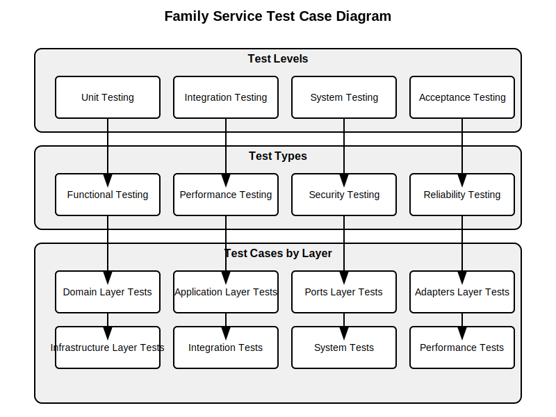

# Software Testing Specification

## Family Service

**Version 1.0.0**

---

## Copyright and License

MIT License

Copyright (c) 2025 A Bit of Help, Inc.

Permission is hereby granted, free of charge, to any person obtaining a copy
of this software and associated documentation files (the "Software"), to deal
in the Software without restriction, including without limitation the rights
to use, copy, modify, merge, publish, distribute, sublicense, and/or sell
copies of the Software, and to permit persons to whom the Software is
furnished to do so, subject to the following conditions:

The above copyright notice and this permission notice shall be included in all
copies or substantial portions of the Software.

THE SOFTWARE IS PROVIDED "AS IS", WITHOUT WARRANTY OF ANY KIND, EXPRESS OR
IMPLIED, INCLUDING BUT NOT LIMITED TO THE WARRANTIES OF MERCHANTABILITY,
FITNESS FOR A PARTICULAR PURPOSE AND NONINFRINGEMENT. IN NO EVENT SHALL THE
AUTHORS OR COPYRIGHT HOLDERS BE LIABLE FOR ANY CLAIM, DAMAGES OR OTHER
LIABILITY, WHETHER IN AN ACTION OF CONTRACT, TORT OR OTHERWISE, ARISING FROM,
OUT OF OR IN CONNECTION WITH THE SOFTWARE OR THE USE OR OTHER DEALINGS IN THE
SOFTWARE.

---

## Table of Contents

1. [Introduction](#1-introduction)
   1. [Purpose](#11-purpose)
   2. [Scope](#12-scope)
   3. [Definitions, Acronyms, and Abbreviations](#13-definitions-acronyms-and-abbreviations)
   4. [References](#14-references)
   5. [Overview](#15-overview)
2. [Test Strategy](#2-test-strategy)
   1. [Testing Objectives](#21-testing-objectives)
   2. [Testing Approach](#22-testing-approach)
   3. [Testing Levels](#23-testing-levels)
   4. [Testing Types](#24-testing-types)
   5. [Testing Tools](#25-testing-tools)
   6. [Testing Environment](#26-testing-environment)
   7. [Testing Schedule](#27-testing-schedule)
   8. [Testing Roles and Responsibilities](#28-testing-roles-and-responsibilities)
3. [Test Plan](#3-test-plan)
   1. [Test Items](#31-test-items)
   2. [Features to be Tested](#32-features-to-be-tested)
   3. [Features Not to be Tested](#33-features-not-to-be-tested)
   4. [Approach](#34-approach)
   5. [Pass/Fail Criteria](#35-passfail-criteria)
   6. [Suspension Criteria and Resumption Requirements](#36-suspension-criteria-and-resumption-requirements)
   7. [Test Deliverables](#37-test-deliverables)
   8. [Testing Tasks](#38-testing-tasks)
   9. [Environmental Needs](#39-environmental-needs)
   10. [Responsibilities](#310-responsibilities)
   11. [Staffing and Training Needs](#311-staffing-and-training-needs)
   12. [Schedule](#312-schedule)
   13. [Risks and Contingencies](#313-risks-and-contingencies)
   14. [Approvals](#314-approvals)
4. [Test Cases](#4-test-cases)
   1. [Domain Layer Test Cases](#41-domain-layer-test-cases)
   2. [Application Layer Test Cases](#42-application-layer-test-cases)
   3. [Adapters Layer Test Cases](#43-adapters-layer-test-cases)
   4. [Infrastructure Layer Test Cases](#44-infrastructure-layer-test-cases)
   5. [Integration Test Cases](#45-integration-test-cases)
   6. [System Test Cases](#46-system-test-cases)
   7. [Performance Test Cases](#47-performance-test-cases)
   8. [Security Test Cases](#48-security-test-cases)
5. [Test Environment](#5-test-environment)
   1. [Hardware](#51-hardware)
   2. [Software](#52-software)
   3. [Network](#53-network)
   4. [Security](#54-security)
   5. [Tools](#55-tools)
6. [Test Deliverables](#6-test-deliverables)
   1. [Test Plan](#61-test-plan)
   2. [Test Cases](#62-test-cases)
   3. [Test Scripts](#63-test-scripts)
   4. [Test Data](#64-test-data)
   5. [Test Reports](#65-test-reports)
   6. [Test Logs](#66-test-logs)
   7. [Defect Reports](#67-defect-reports)
7. [UML Diagrams](#7-uml-diagrams)
   1. [Test Case Diagram](#71-test-case-diagram)
   2. [Test Activity Diagram](#72-test-activity-diagram)
   3. [Test Sequence Diagram](#73-test-sequence-diagram)
8. [Appendices](#8-appendices)
   1. [Appendix A: Glossary](#appendix-a-glossary)
   2. [Appendix B: References](#appendix-b-references)
   3. [Appendix C: Test Data](#appendix-c-test-data)
   4. [Appendix D: Test Scripts](#appendix-d-test-scripts)

---

## 1. Introduction

### 1.1 Purpose

This Software Testing Specification (STS) document describes the testing approach, strategy, and plan for the Family Service application. It is intended to be used by the development and testing teams to ensure that the system meets the specified requirements and is of high quality.

### 1.2 Scope

The Family Service is a backend application that provides APIs for managing family relationships, specifically parents and their children. The system allows creating, reading, updating, and deleting parent and child records, as well as managing the relationships between them.

This STS covers the testing of all components of the Family Service, including the domain layer, application layer, ports layer, adapters layer, and infrastructure layer. It includes unit testing, integration testing, system testing, performance testing, and security testing.

### 1.3 Definitions, Acronyms, and Abbreviations

- **API**: Application Programming Interface
- **CRUD**: Create, Read, Update, Delete
- **DI**: Dependency Injection
- **GraphQL**: A query language for APIs and a runtime for executing those queries
- **Hexagonal Architecture**: An architectural pattern that isolates the core business logic from external concerns
- **JWT**: JSON Web Token
- **OIDC**: OpenID Connect
- **REST**: Representational State Transfer
- **SDS**: Software Design Specification
- **SRS**: Software Requirements Specification
- **STS**: Software Testing Specification
- **TDD**: Test-Driven Development
- **UUID**: Universally Unique Identifier

### 1.4 References

- Software Requirements Specification (SRS) for Family Service
- Software Design Specification (SDS) for Family Service
- Hexagonal Architecture (Ports and Adapters) pattern
- GraphQL Specification
- OpenTelemetry Specification
- MongoDB Documentation
- PostgreSQL Documentation
- Go Testing Documentation

### 1.5 Overview

The remainder of this document is organized as follows:

- Section 2 describes the test strategy, including testing objectives, approach, levels, types, tools, environment, schedule, and roles and responsibilities.
- Section 3 details the test plan, including test items, features to be tested, approach, pass/fail criteria, test deliverables, and testing tasks.
- Section 4 describes the test cases for each layer of the system.
- Section 5 details the test environment, including hardware, software, network, security, and tools.
- Section 6 describes the test deliverables, including test plan, test cases, test scripts, test data, test reports, test logs, and defect reports.
- Section 7 includes UML diagrams for test cases, test activities, and test sequences.
- Section 8 contains appendices with additional information.

---

## 2. Test Strategy

### 2.1 Testing Objectives

The objectives of testing the Family Service are:

1. **Verify Requirements**: Ensure that the system meets all the specified requirements in the SRS.
2. **Validate Design**: Ensure that the system is implemented according to the design specified in the SDS.
3. **Detect Defects**: Identify and report defects in the system.
4. **Ensure Quality**: Ensure that the system is of high quality and meets the specified quality attributes.
5. **Verify Performance**: Ensure that the system meets the specified performance requirements.
6. **Verify Security**: Ensure that the system is secure and protects sensitive data.
7. **Verify Reliability**: Ensure that the system is reliable and handles errors gracefully.
8. **Verify Maintainability**: Ensure that the system is maintainable and follows clean code principles.

### 2.2 Testing Approach

The testing approach for the Family Service is based on the following principles:

1. **Test-Driven Development (TDD)**: Write tests before implementing the code.
2. **Continuous Integration**: Run tests automatically on every code change.
3. **Automated Testing**: Automate as many tests as possible to ensure repeatability and efficiency.
4. **Comprehensive Coverage**: Test all layers of the system, from the domain layer to the infrastructure layer.
5. **Realistic Test Data**: Use realistic test data to ensure that the system works correctly in real-world scenarios.
6. **Isolation**: Test each component in isolation to ensure that it works correctly independently of other components.
7. **Integration**: Test the integration between components to ensure that they work correctly together.
8. **System Testing**: Test the system as a whole to ensure that it meets the specified requirements.

### 2.3 Testing Levels

The Family Service will be tested at the following levels:

1. **Unit Testing**: Testing individual components in isolation.
2. **Integration Testing**: Testing the integration between components.
3. **System Testing**: Testing the system as a whole.
4. **Acceptance Testing**: Testing the system against the specified requirements.

### 2.4 Testing Types

The following types of testing will be performed on the Family Service:

1. **Functional Testing**: Testing the functional requirements of the system.
2. **Performance Testing**: Testing the performance of the system under load.
3. **Security Testing**: Testing the security of the system.
4. **Reliability Testing**: Testing the reliability of the system under various conditions.
5. **Maintainability Testing**: Testing the maintainability of the system.
6. **Usability Testing**: Testing the usability of the system's APIs.

### 2.5 Testing Tools

The following tools will be used for testing the Family Service:

1. **Go Testing Framework**: For unit and integration testing.
2. **Testify**: For assertions and mocking.
3. **Postman**: For API testing.
4. **JMeter**: For performance testing.
5. **OWASP ZAP**: For security testing.
6. **Docker**: For creating isolated test environments.
7. **GitHub Actions**: For continuous integration and automated testing.

### 2.6 Testing Environment

The testing environment for the Family Service will include:

1. **Development Environment**: For unit and integration testing during development.
2. **Testing Environment**: For system and acceptance testing before deployment.
3. **Staging Environment**: For final testing before production deployment.
4. **Production Environment**: For monitoring and testing in production.

### 2.7 Testing Schedule

The testing schedule for the Family Service will be aligned with the development schedule:

1. **Unit Testing**: Continuously during development.
2. **Integration Testing**: After each feature is implemented.
3. **System Testing**: Before each release.
4. **Acceptance Testing**: Before each release.

### 2.8 Testing Roles and Responsibilities

The following roles and responsibilities are defined for testing the Family Service:

1. **Developers**: Responsible for unit testing and integration testing.
2. **Testers**: Responsible for system testing and acceptance testing.
3. **DevOps Engineers**: Responsible for setting up and maintaining the testing environment.
4. **Project Manager**: Responsible for coordinating testing activities and ensuring that testing is completed on schedule.

---

## 3. Test Plan

### 3.1 Test Items

The following items will be tested:

1. **Domain Layer**: The core business entities and business rules.
2. **Application Layer**: The use cases and application services.
3. **Ports Layer**: The interfaces for interacting with the application.
4. **Adapters Layer**: The implementations of the interfaces defined in the ports layer.
5. **Infrastructure Layer**: The technical capabilities provided to the system.
6. **GraphQL API**: The API exposed to clients.
7. **Health API**: The API for monitoring the health of the system.
8. **Metrics API**: The API for collecting metrics.

### 3.2 Features to be Tested

The following features will be tested:

1. **Parent Management**: Create, read, update, and delete parent records.
2. **Child Management**: Create, read, update, and delete child records.
3. **Relationship Management**: Associate children with parents and manage these relationships.
4. **Health Monitoring**: Check the health of the system.
5. **Metrics Collection**: Collect metrics for monitoring the system.
6. **Authentication**: Authenticate API requests.
7. **Authorization**: Authorize API requests.
8. **Validation**: Validate input data.
9. **Error Handling**: Handle errors gracefully.
10. **Logging**: Log events and errors.
11. **Configuration**: Configure the system.
12. **Dependency Injection**: Manage object creation and dependencies.
13. **Graceful Shutdown**: Shut down the system gracefully.

### 3.3 Features Not to be Tested

The following features will not be tested:

1. **Third-Party Libraries**: Libraries that are already well-tested and widely used.
2. **Generated Code**: Code that is generated by tools and not written by hand.

### 3.4 Approach

The testing approach for the Family Service is based on the following principles:

1. **Test-Driven Development (TDD)**: Write tests before implementing the code.
2. **Continuous Integration**: Run tests automatically on every code change.
3. **Automated Testing**: Automate as many tests as possible to ensure repeatability and efficiency.
4. **Comprehensive Coverage**: Test all layers of the system, from the domain layer to the infrastructure layer.
5. **Realistic Test Data**: Use realistic test data to ensure that the system works correctly in real-world scenarios.
6. **Isolation**: Test each component in isolation to ensure that it works correctly independently of other components.
7. **Integration**: Test the integration between components to ensure that they work correctly together.
8. **System Testing**: Test the system as a whole to ensure that it meets the specified requirements.

### 3.5 Pass/Fail Criteria

The following criteria will be used to determine whether a test passes or fails:

1. **Functional Correctness**: The system behaves as specified in the requirements.
2. **Performance**: The system meets the specified performance requirements.
3. **Security**: The system is secure and protects sensitive data.
4. **Reliability**: The system is reliable and handles errors gracefully.
5. **Maintainability**: The system is maintainable and follows clean code principles.

### 3.6 Suspension Criteria and Resumption Requirements

Testing will be suspended if:

1. **Critical Defects**: Critical defects are found that prevent further testing.
2. **Environment Issues**: Issues with the testing environment prevent testing.
3. **Resource Constraints**: Resources are not available for testing.

Testing will resume when:

1. **Critical Defects Fixed**: Critical defects have been fixed.
2. **Environment Issues Resolved**: Issues with the testing environment have been resolved.
3. **Resources Available**: Resources are available for testing.

### 3.7 Test Deliverables

The following deliverables will be produced during testing:

1. **Test Plan**: This document.
2. **Test Cases**: Detailed test cases for each feature.
3. **Test Scripts**: Automated test scripts.
4. **Test Data**: Data used for testing.
5. **Test Reports**: Reports of test results.
6. **Test Logs**: Logs of test execution.
7. **Defect Reports**: Reports of defects found during testing.

### 3.8 Testing Tasks

The following tasks will be performed during testing:

1. **Test Planning**: Plan the testing activities.
2. **Test Design**: Design the test cases.
3. **Test Implementation**: Implement the test scripts.
4. **Test Execution**: Execute the tests.
5. **Test Reporting**: Report the test results.
6. **Defect Reporting**: Report defects found during testing.
7. **Defect Tracking**: Track the status of defects.
8. **Test Closure**: Close the testing activities.

### 3.9 Environmental Needs

The following environmental needs are required for testing:

1. **Hardware**: Servers for running the system and tests.
2. **Software**: Operating system, database, and other software required for the system.
3. **Network**: Network connectivity for distributed testing.
4. **Security**: Security measures to protect the testing environment.
5. **Tools**: Testing tools for automated testing.

### 3.10 Responsibilities

The following responsibilities are defined for testing:

1. **Developers**: Responsible for unit testing and integration testing.
2. **Testers**: Responsible for system testing and acceptance testing.
3. **DevOps Engineers**: Responsible for setting up and maintaining the testing environment.
4. **Project Manager**: Responsible for coordinating testing activities and ensuring that testing is completed on schedule.

### 3.11 Staffing and Training Needs

The following staffing and training needs are required for testing:

1. **Developers**: Trained in TDD and automated testing.
2. **Testers**: Trained in system testing and acceptance testing.
3. **DevOps Engineers**: Trained in setting up and maintaining the testing environment.
4. **Project Manager**: Trained in coordinating testing activities.

### 3.12 Schedule

The testing schedule for the Family Service will be aligned with the development schedule:

1. **Unit Testing**: Continuously during development.
2. **Integration Testing**: After each feature is implemented.
3. **System Testing**: Before each release.
4. **Acceptance Testing**: Before each release.

### 3.13 Risks and Contingencies

The following risks and contingencies are identified for testing:

1. **Resource Constraints**: If resources are not available for testing, prioritize critical features and tests.
2. **Schedule Constraints**: If the schedule is tight, prioritize critical features and tests.
3. **Environment Issues**: If there are issues with the testing environment, use alternative environments or simulators.
4. **Tool Issues**: If there are issues with testing tools, use alternative tools or manual testing.

### 3.14 Approvals

The following approvals are required for the test plan:

1. **Project Manager**: Approves the test plan.
2. **Development Lead**: Approves the test plan.
3. **Testing Lead**: Approves the test plan.
4. **Client**: Approves the test plan.

---

## 4. Test Cases

### 4.1 Domain Layer Test Cases

The domain layer contains the core business entities and business rules. The following test cases will be implemented for the domain layer:

#### 4.1.1 Entity Interface Test Cases

1. **Test GetID**: Verify that the GetID method returns the entity's unique identifier.
2. **Test IsDeleted**: Verify that the IsDeleted method checks if the entity is marked as deleted.
3. **Test MarkAsDeleted**: Verify that the MarkAsDeleted method marks the entity as deleted.
4. **Test GetCreatedAt**: Verify that the GetCreatedAt method returns the entity's creation timestamp.
5. **Test GetUpdatedAt**: Verify that the GetUpdatedAt method returns the entity's last update timestamp.
6. **Test GetDeletedAt**: Verify that the GetDeletedAt method returns the entity's deletion timestamp, if any.

#### 4.1.2 Parent Entity Test Cases

1. **Test Parent Creation**: Verify that a parent can be created with valid data.
2. **Test Parent Validation**: Verify that a parent cannot be created with invalid data.
3. **Test AddChild**: Verify that a child can be added to a parent.
4. **Test RemoveChild**: Verify that a child can be removed from a parent.
5. **Test FullName**: Verify that the FullName method returns the parent's full name.
6. **Test Parent Deletion**: Verify that a parent can be marked as deleted.
7. **Test Parent with Children Deletion**: Verify that a parent with children cannot be deleted.

#### 4.1.3 Child Entity Test Cases

1. **Test Child Creation**: Verify that a child can be created with valid data.
2. **Test Child Validation**: Verify that a child cannot be created with invalid data.
3. **Test FullName**: Verify that the FullName method returns the child's full name.
4. **Test Age**: Verify that the Age method calculates the child's current age based on their birth date.
5. **Test Child Deletion**: Verify that a child can be marked as deleted.

### 4.2 Application Layer Test Cases

The application layer contains the use cases and application services. The following test cases will be implemented for the application layer:

#### 4.2.1 Parent Service Test Cases

1. **Test CreateParent**: Verify that a parent can be created with valid data.
2. **Test CreateParent with Invalid Data**: Verify that a parent cannot be created with invalid data.
3. **Test GetParentByID**: Verify that a parent can be retrieved by ID.
4. **Test GetParentByID with Non-existent ID**: Verify that an error is returned when trying to retrieve a non-existent parent.
5. **Test UpdateParent**: Verify that a parent can be updated with valid data.
6. **Test UpdateParent with Invalid Data**: Verify that a parent cannot be updated with invalid data.
7. **Test DeleteParent**: Verify that a parent can be deleted.
8. **Test DeleteParent with Children**: Verify that a parent with children cannot be deleted.
9. **Test ListParents**: Verify that parents can be listed with pagination and filtering.
10. **Test CountParents**: Verify that parents can be counted based on filter criteria.

#### 4.2.2 Child Service Test Cases

1. **Test CreateChild**: Verify that a child can be created with valid data.
2. **Test CreateChild with Invalid Data**: Verify that a child cannot be created with invalid data.
3. **Test CreateChild with Non-existent Parent**: Verify that an error is returned when trying to create a child with a non-existent parent.
4. **Test GetChildByID**: Verify that a child can be retrieved by ID.
5. **Test GetChildByID with Non-existent ID**: Verify that an error is returned when trying to retrieve a non-existent child.
6. **Test UpdateChild**: Verify that a child can be updated with valid data.
7. **Test UpdateChild with Invalid Data**: Verify that a child cannot be updated with invalid data.
8. **Test DeleteChild**: Verify that a child can be deleted.
9. **Test ListChildrenByParentID**: Verify that children can be listed for a specific parent.
10. **Test ListChildren**: Verify that children can be listed with pagination and filtering.
11. **Test CountChildren**: Verify that children can be counted based on filter criteria.

### 4.3 Adapters Layer Test Cases

The adapters layer implements the interfaces defined in the ports layer. The following test cases will be implemented for the adapters layer:

#### 4.3.1 GraphQL Adapter Test Cases

1. **Test parent Query**: Verify that a parent can be retrieved by ID.
2. **Test parents Query**: Verify that parents can be listed with pagination and filtering.
3. **Test parentsCount Query**: Verify that parents can be counted based on filter criteria.
4. **Test child Query**: Verify that a child can be retrieved by ID.
5. **Test children Query**: Verify that children can be listed with pagination and filtering.
6. **Test childrenCount Query**: Verify that children can be counted based on filter criteria.
7. **Test childrenByParent Query**: Verify that children can be listed for a specific parent.
8. **Test createParent Mutation**: Verify that a parent can be created with valid data.
9. **Test updateParent Mutation**: Verify that a parent can be updated with valid data.
10. **Test deleteParent Mutation**: Verify that a parent can be deleted.
11. **Test createChild Mutation**: Verify that a child can be created with valid data.
12. **Test updateChild Mutation**: Verify that a child can be updated with valid data.
13. **Test deleteChild Mutation**: Verify that a child can be deleted.

#### 4.3.2 MongoDB Adapter Test Cases

1. **Test Create Parent**: Verify that a parent can be created in MongoDB.
2. **Test GetByID Parent**: Verify that a parent can be retrieved by ID from MongoDB.
3. **Test Update Parent**: Verify that a parent can be updated in MongoDB.
4. **Test Delete Parent**: Verify that a parent can be deleted in MongoDB.
5. **Test List Parents**: Verify that parents can be listed with pagination and filtering from MongoDB.
6. **Test Count Parents**: Verify that parents can be counted based on filter criteria from MongoDB.
7. **Test Create Child**: Verify that a child can be created in MongoDB.
8. **Test GetByID Child**: Verify that a child can be retrieved by ID from MongoDB.
9. **Test Update Child**: Verify that a child can be updated in MongoDB.
10. **Test Delete Child**: Verify that a child can be deleted in MongoDB.
11. **Test ListByParentID Children**: Verify that children can be listed for a specific parent from MongoDB.
12. **Test List Children**: Verify that children can be listed with pagination and filtering from MongoDB.
13. **Test Count Children**: Verify that children can be counted based on filter criteria from MongoDB.

#### 4.3.3 PostgreSQL Adapter Test Cases

1. **Test Create Parent**: Verify that a parent can be created in PostgreSQL.
2. **Test GetByID Parent**: Verify that a parent can be retrieved by ID from PostgreSQL.
3. **Test Update Parent**: Verify that a parent can be updated in PostgreSQL.
4. **Test Delete Parent**: Verify that a parent can be deleted in PostgreSQL.
5. **Test List Parents**: Verify that parents can be listed with pagination and filtering from PostgreSQL.
6. **Test Count Parents**: Verify that parents can be counted based on filter criteria from PostgreSQL.
7. **Test Create Child**: Verify that a child can be created in PostgreSQL.
8. **Test GetByID Child**: Verify that a child can be retrieved by ID from PostgreSQL.
9. **Test Update Child**: Verify that a child can be updated in PostgreSQL.
10. **Test Delete Child**: Verify that a child can be deleted in PostgreSQL.
11. **Test ListByParentID Children**: Verify that children can be listed for a specific parent from PostgreSQL.
12. **Test List Children**: Verify that children can be listed with pagination and filtering from PostgreSQL.
13. **Test Count Children**: Verify that children can be counted based on filter criteria from PostgreSQL.

### 4.4 Infrastructure Layer Test Cases

The infrastructure layer provides technical capabilities to the system. The following test cases will be implemented for the infrastructure layer:

#### 4.4.1 Auth Test Cases

1. **Test OIDC Authentication**: Verify that OIDC authentication works correctly.
2. **Test JWT Validation**: Verify that JWT validation works correctly.
3. **Test Authorization**: Verify that authorization works correctly.

#### 4.4.2 Config Test Cases

1. **Test Config Loading**: Verify that configuration can be loaded from a file.
2. **Test Config Validation**: Verify that configuration is validated correctly.
3. **Test Environment Variables**: Verify that environment variables are used correctly.

#### 4.4.3 Dependency Injection Test Cases

1. **Test Container Creation**: Verify that a DI container can be created.
2. **Test Service Registration**: Verify that services can be registered in the container.
3. **Test Service Resolution**: Verify that services can be resolved from the container.

#### 4.4.4 Health Test Cases

1. **Test Health Check**: Verify that the health check works correctly.
2. **Test Database Health**: Verify that the database health check works correctly.

#### 4.4.5 Logging Test Cases

1. **Test Logging**: Verify that logging works correctly.
2. **Test Log Levels**: Verify that different log levels work correctly.
3. **Test Structured Logging**: Verify that structured logging works correctly.

#### 4.4.6 Middleware Test Cases

1. **Test Auth Middleware**: Verify that the auth middleware works correctly.
2. **Test Logging Middleware**: Verify that the logging middleware works correctly.
3. **Test Recovery Middleware**: Verify that the recovery middleware works correctly.

#### 4.4.7 Server Test Cases

1. **Test Server Start**: Verify that the server can be started.
2. **Test Server Stop**: Verify that the server can be stopped.
3. **Test Request Handling**: Verify that the server handles requests correctly.

#### 4.4.8 Shutdown Test Cases

1. **Test Graceful Shutdown**: Verify that the server shuts down gracefully.
2. **Test Shutdown Timeout**: Verify that the server respects the shutdown timeout.

#### 4.4.9 Telemetry Test Cases

1. **Test Metrics Collection**: Verify that metrics are collected correctly.
2. **Test Tracing**: Verify that tracing works correctly.
3. **Test Prometheus Integration**: Verify that Prometheus integration works correctly.

#### 4.4.10 Validation Test Cases

1. **Test Input Validation**: Verify that input validation works correctly.
2. **Test Validation Errors**: Verify that validation errors are returned correctly.

### 4.5 Integration Test Cases

Integration tests verify that the components work correctly together. The following integration test cases will be implemented:

1. **Test Parent Creation and Retrieval**: Verify that a parent can be created and then retrieved.
2. **Test Child Creation and Retrieval**: Verify that a child can be created and then retrieved.
3. **Test Parent Update and Retrieval**: Verify that a parent can be updated and then retrieved.
4. **Test Child Update and Retrieval**: Verify that a child can be updated and then retrieved.
5. **Test Parent Deletion and Retrieval**: Verify that a parent can be deleted and then cannot be retrieved.
6. **Test Child Deletion and Retrieval**: Verify that a child can be deleted and then cannot be retrieved.
7. **Test Child Creation with Parent Association**: Verify that a child can be created with a parent association.
8. **Test Child Retrieval with Parent**: Verify that a child can be retrieved with its parent.
9. **Test Parent Retrieval with Children**: Verify that a parent can be retrieved with its children.
10. **Test Parent Deletion with Children**: Verify that a parent with children cannot be deleted.

### 4.6 System Test Cases

System tests verify that the system as a whole meets the specified requirements. The following system test cases will be implemented:

1. **Test Parent Management**: Verify that parents can be created, retrieved, updated, and deleted.
2. **Test Child Management**: Verify that children can be created, retrieved, updated, and deleted.
3. **Test Relationship Management**: Verify that children can be associated with parents and these relationships can be managed.
4. **Test Health Monitoring**: Verify that the health of the system can be monitored.
5. **Test Metrics Collection**: Verify that metrics can be collected for monitoring the system.
6. **Test Authentication**: Verify that API requests are authenticated.
7. **Test Authorization**: Verify that API requests are authorized.
8. **Test Validation**: Verify that input data is validated.
9. **Test Error Handling**: Verify that errors are handled gracefully.
10. **Test Logging**: Verify that events and errors are logged.
11. **Test Configuration**: Verify that the system can be configured.
12. **Test Dependency Injection**: Verify that object creation and dependencies are managed.
13. **Test Graceful Shutdown**: Verify that the system shuts down gracefully.

### 4.7 Performance Test Cases

Performance tests verify that the system meets the specified performance requirements. The following performance test cases will be implemented:

1. **Test Response Time**: Verify that the system responds to API requests within the specified time.
2. **Test Throughput**: Verify that the system can handle the specified number of concurrent requests.
3. **Test Resource Utilization**: Verify that the system operates within the specified resource limits.
4. **Test Database Performance**: Verify that database operations are performed within the specified time.
5. **Test Scalability**: Verify that the system can scale to handle increased load.

### 4.8 Security Test Cases

Security tests verify that the system is secure and protects sensitive data. The following security test cases will be implemented:

1. **Test Authentication**: Verify that only authenticated users can access the API.
2. **Test Authorization**: Verify that users can only access resources they are authorized to access.
3. **Test Input Validation**: Verify that input data is validated to prevent injection attacks.
4. **Test Error Handling**: Verify that errors are handled gracefully and do not reveal sensitive information.
5. **Test Data Protection**: Verify that sensitive data is protected.
6. **Test HTTPS**: Verify that the API is accessible only over HTTPS.
7. **Test JWT Security**: Verify that JWTs are secure and cannot be tampered with.

---

## 5. Test Environment

### 5.1 Hardware

The following hardware is required for the test environment:

1. **Servers**: For running the system and tests.
2. **Workstations**: For developers and testers.
3. **Network Equipment**: For network connectivity.

### 5.2 Software

The following software is required for the test environment:

1. **Operating System**: Linux or Windows.
2. **Database**: MongoDB and PostgreSQL.
3. **Go**: For running the system and tests.
4. **Docker**: For containerization.
5. **Kubernetes**: For orchestration.
6. **Prometheus**: For metrics collection.
7. **Grafana**: For metrics visualization.
8. **Jaeger**: For distributed tracing.
9. **OIDC Provider**: For authentication.

### 5.3 Network

The following network configuration is required for the test environment:

1. **Internal Network**: For communication between components.
2. **External Network**: For external access to the API.
3. **Firewall**: For network security.

### 5.4 Security

The following security measures are required for the test environment:

1. **Authentication**: For user authentication.
2. **Authorization**: For user authorization.
3. **Encryption**: For data protection.
4. **Firewall**: For network security.
5. **Intrusion Detection**: For detecting security breaches.

### 5.5 Tools

The following tools are required for the test environment:

1. **Go Testing Framework**: For unit and integration testing.
2. **Testify**: For assertions and mocking.
3. **Postman**: For API testing.
4. **JMeter**: For performance testing.
5. **OWASP ZAP**: For security testing.
6. **Docker**: For creating isolated test environments.
7. **GitHub Actions**: For continuous integration and automated testing.

---

## 6. Test Deliverables

### 6.1 Test Plan

The test plan includes:

1. **Test Strategy**: The overall approach to testing.
2. **Test Items**: The items to be tested.
3. **Features to be Tested**: The features to be tested.
4. **Features Not to be Tested**: The features not to be tested.
5. **Approach**: The approach to testing.
6. **Pass/Fail Criteria**: The criteria for determining whether a test passes or fails.
7. **Suspension Criteria and Resumption Requirements**: The criteria for suspending testing and the requirements for resuming testing.
8. **Test Deliverables**: The deliverables to be produced during testing.
9. **Testing Tasks**: The tasks to be performed during testing.
10. **Environmental Needs**: The environmental needs for testing.
11. **Responsibilities**: The responsibilities for testing.
12. **Staffing and Training Needs**: The staffing and training needs for testing.
13. **Schedule**: The schedule for testing.
14. **Risks and Contingencies**: The risks and contingencies for testing.
15. **Approvals**: The approvals required for the test plan.

### 6.2 Test Cases

The test cases include:

1. **Test Case ID**: A unique identifier for the test case.
2. **Test Case Name**: A descriptive name for the test case.
3. **Test Case Description**: A description of the test case.
4. **Preconditions**: The conditions that must be met before the test case can be executed.
5. **Test Steps**: The steps to be performed during the test case.
6. **Expected Results**: The expected results of the test case.
7. **Actual Results**: The actual results of the test case.
8. **Status**: The status of the test case (passed, failed, blocked, etc.).
9. **Comments**: Any comments about the test case.

### 6.3 Test Scripts

The test scripts include:

1. **Test Script ID**: A unique identifier for the test script.
2. **Test Script Name**: A descriptive name for the test script.
3. **Test Script Description**: A description of the test script.
4. **Test Cases**: The test cases covered by the test script.
5. **Setup**: The setup required for the test script.
6. **Execution**: The execution of the test script.
7. **Teardown**: The teardown required after the test script.
8. **Expected Results**: The expected results of the test script.
9. **Actual Results**: The actual results of the test script.
10. **Status**: The status of the test script (passed, failed, blocked, etc.).
11. **Comments**: Any comments about the test script.

### 6.4 Test Data

The test data includes:

1. **Test Data ID**: A unique identifier for the test data.
2. **Test Data Name**: A descriptive name for the test data.
3. **Test Data Description**: A description of the test data.
4. **Test Cases**: The test cases that use the test data.
5. **Data**: The actual test data.
6. **Comments**: Any comments about the test data.

### 6.5 Test Reports

The test reports include:

1. **Test Report ID**: A unique identifier for the test report.
2. **Test Report Name**: A descriptive name for the test report.
3. **Test Report Description**: A description of the test report.
4. **Test Cases**: The test cases covered by the test report.
5. **Test Results**: The results of the test cases.
6. **Defects**: The defects found during testing.
7. **Conclusion**: The conclusion of the test report.
8. **Recommendations**: The recommendations based on the test report.
9. **Comments**: Any comments about the test report.

### 6.6 Test Logs

The test logs include:

1. **Test Log ID**: A unique identifier for the test log.
2. **Test Log Name**: A descriptive name for the test log.
3. **Test Log Description**: A description of the test log.
4. **Test Cases**: The test cases covered by the test log.
5. **Log Entries**: The entries in the test log.
6. **Comments**: Any comments about the test log.

### 6.7 Defect Reports

The defect reports include:

1. **Defect ID**: A unique identifier for the defect.
2. **Defect Name**: A descriptive name for the defect.
3. **Defect Description**: A description of the defect.
4. **Test Cases**: The test cases that found the defect.
5. **Severity**: The severity of the defect.
6. **Priority**: The priority of the defect.
7. **Status**: The status of the defect (open, closed, etc.).
8. **Assigned To**: The person assigned to fix the defect.
9. **Comments**: Any comments about the defect.

---

## 7. UML Diagrams

### 7.1 Test Case Diagram

The test case diagram illustrates the test cases for the Family Service. It shows the relationships between test cases and the features they test.

### 7.2 Test Activity Diagram

The test activity diagram illustrates the flow of testing activities for the Family Service. It shows the sequence of activities from test planning to test closure.

### 7.3 Test Sequence Diagram

The test sequence diagram illustrates the sequence of interactions during testing. It shows the interactions between the tester, the system, and the test environment.

---

## 8. Appendices

### Appendix A: Glossary

- **Entity**: A domain object with a unique identity.
- **Repository**: A component that provides data access and persistence for entities.
- **Use Case**: A specific business goal or task that the system must accomplish.
- **Port**: An interface that defines how the application interacts with external systems.
- **Adapter**: An implementation of a port that connects the application to external systems.
- **Soft Delete**: A technique where records are marked as deleted rather than being physically removed from the database.
- **Test Case**: A set of conditions or variables under which a tester will determine whether a system under test satisfies requirements or works correctly.
- **Test Script**: A set of instructions that will be performed on the system under test to test that the system functions as expected.
- **Test Data**: Data that is used in testing.
- **Test Report**: A document that describes the results of testing.
- **Test Log**: A chronological record of relevant details about the execution of tests.
- **Defect**: A flaw in a component or system that can cause the component or system to fail to perform its required function.

### Appendix B: References

- Software Requirements Specification (SRS) for Family Service
- Software Design Specification (SDS) for Family Service
- Hexagonal Architecture (Ports and Adapters) pattern
- GraphQL Specification
- OpenTelemetry Specification
- MongoDB Documentation
- PostgreSQL Documentation
- Go Testing Documentation

### Appendix C: Test Data

The following test data will be used for testing:

1. **Valid Parent Data**: Data for creating valid parents.
2. **Invalid Parent Data**: Data for testing validation of parent data.
3. **Valid Child Data**: Data for creating valid children.
4. **Invalid Child Data**: Data for testing validation of child data.
5. **Parent-Child Relationship Data**: Data for testing parent-child relationships.

### Appendix D: Test Scripts

The following test scripts will be used for testing:

1. **Unit Test Scripts**: Scripts for unit testing.
2. **Integration Test Scripts**: Scripts for integration testing.
3. **System Test Scripts**: Scripts for system testing.
4. **Performance Test Scripts**: Scripts for performance testing.
5. **Security Test Scripts**: Scripts for security testing.